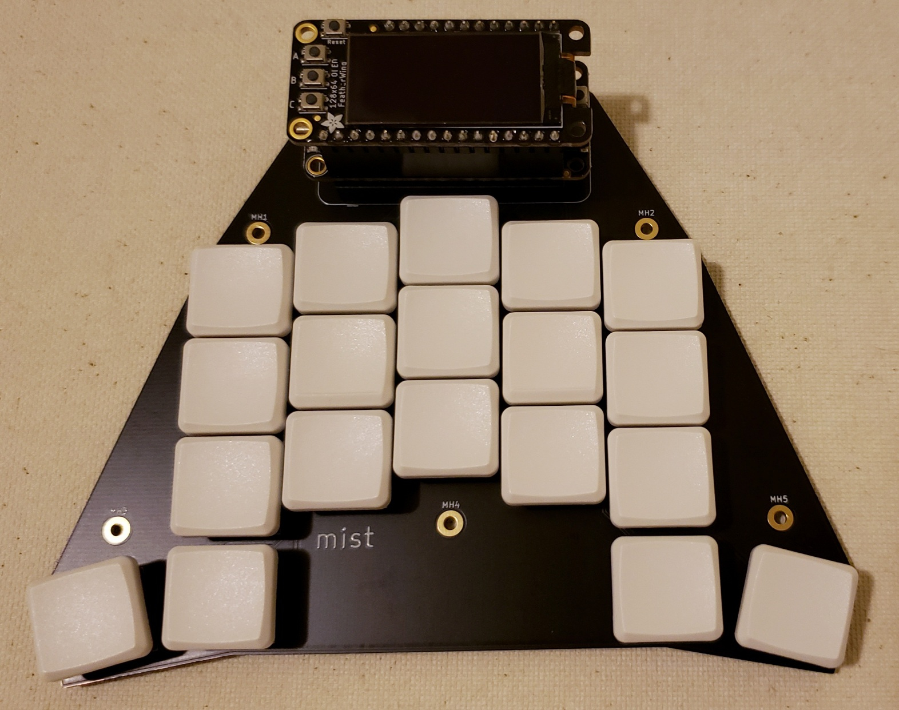

# Mist

Mist is a one-handed symmetrical and columnar keyboard, with mirrored thumb keys providing 17 usable keys for either hand. It is ideal for anyone needing to type with one hand, or those wanting a staggered one-handed macro pad that can be used with either hand.

The name comes from its primary design goals: **MI**rrored, **ST**aggered.

Mist exists because accessibility should be more accessible. Commercial one-handed keyboards can be prohibitively expensive, and there are few open source keyboards designed specifically for one-handed use. Through this and the [purple firmware/layout project](https://github.com/defiant00/purple) we hope to provide another option.

## Parts

* 1x PCB
* 1x Adafruit Feather (recommended: [RP2040](https://www.adafruit.com/product/4884))
* 19x Kailh Choc switches
* 19x Choc spacing 1u keycaps (recommended: MBK)
* Some stick on feet
* **Optional**
  * Extra PCB as a bottom plate
  * M2 standoffs and screws
  * Adafruit Featherwings (OLEDs, LEDs, etc.) or STEMMA QT accessories if your Feather supports them

## Assembly

1. Solder on the Feather and switches. You can slot the Feather if you prefer.
2. **Optional** - Attach the extra PCB as a bottom plate using standoffs and screws at the five mounting points.
3. Keycaps!
4. Apply feet near the corners of the board.

## Release Notes

### 1.0 [2022-01-02]

* Initial version
